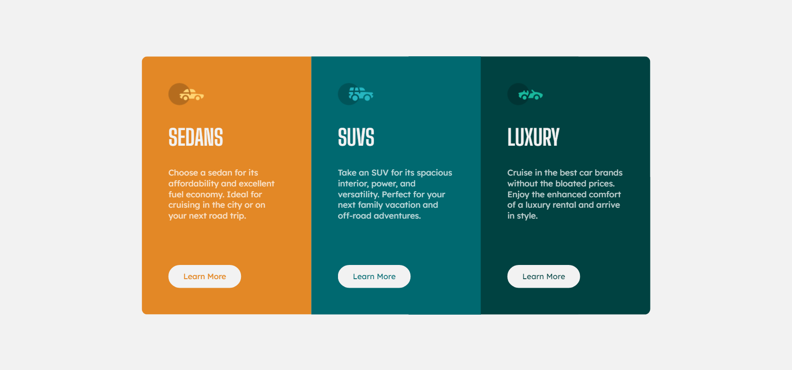

# Frontend Mentor - 3-column preview card component solution

This is a solution to the [3-column preview card component challenge on Frontend Mentor](https://www.frontendmentor.io/challenges/3column-preview-card-component-pH92eAR2-).

## Table of contents

- [Overview](#overview)
  - [The challenge](#the-challenge)
  - [Screenshot](#screenshot)
  - [Links](#links)
- [My process](#my-process)
  - [Built with](#built-with)
  - [What I learned](#what-i-learned)
  - [Continued development](#continued-development)
  - [Useful resources](#useful-resources)

## Overview

I found this challenge pretty easy. I used Flexbox for the design I thought it was the most logical choice. 
I wanted to add an extra challenge by trying not to use any media queries and still have a responsive website.
I had two issues:
  1 - When changing the size of the screen the border-radius disappears. I assume that the only way I can solve this is with media queries.
  2 - This issue Is not a major problem, however when the screen width is less than 260px the paragraph text doesn't wrap.

If anyone has the solutions to these issues it would be greatly appreciated.

This is the first time that I have made a thorough readme. Any advice would be great.

Also, any feedback on better practices when coding would be great.

Thanks.

### The challenge

Users should be able to:

- View the optimal layout depending on their device's screen size
- See hover states for interactive elements

### Screenshot

### Links

- Solution URL: [View code](https://github.com/arfarobs/3-column-preview-card-component)
- Live Site URL: [View live site](https://arfarobs.github.io/3-column-preview-card-component/)

## My process

1 - Sketch out a rough wireframe.
2 - Get the HTML boilerplate done.
3 - Implement the Flexbox CSS.
4 - Get the colors/fonts etc correct.
5 - Make sure it's responsive.
6 - Add focus and hover effects.
7 - Write the readme.
8 - finalize and tweak if necessary.

### Built with

- Semantic HTML5 markup
- CSS
- Flexbox

### What I learned

- I literally just learned about CSS custom properties by completing this readme.
- I learned how to write a readme. 
- I learned that background-color has an unset value.
- I improved my markdown skills.

### Continued development

These are the skills that I want to improve in future projects after completing this.
- Accessibility.
- Markdown.
- Writing a readme.

### Useful resources

- [Markdown cheetsheet](https://www.markdownguide.org/cheat-sheet/) - This helped me with writing the readme.